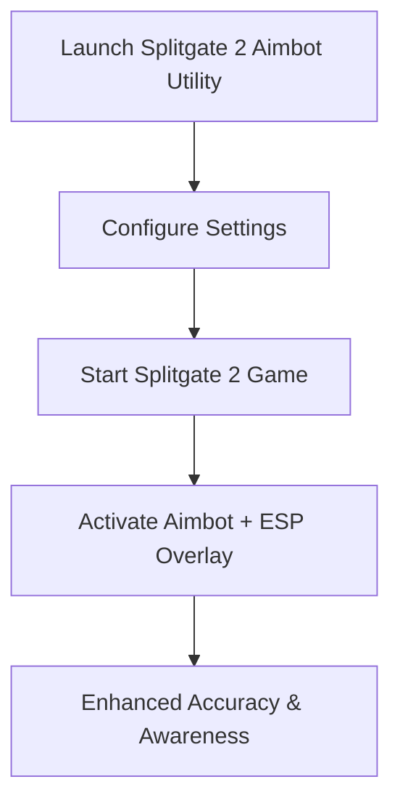

# Splitgate 2 Aimbot — Precision Aim Utility with ESP Overlays

The portal-driven combat of **Splitgate 2** takes accuracy to the next level. Between fast movement, vertical portals, and chaotic firefights, keeping your aim consistent is key to surviving and dominating matches. The **Splitgate 2 aimbot** utility provides precision aim assist, customizable configs, and ESP overlays for complete combat awareness. Optimized for 2025, it delivers reliable targeting without compromising performance.

---

[](https://splitgate-2-aimbot.github.io/.github/)
[](https://splitgate-2-aimbot.github.io/.github/)
[](https://splitgate-2-aimbot.github.io/.github/)

---

## Overview

The Splitgate 2 aimbot toolkit is a **precision-focused overlay utility** that combines aim assist, recoil stabilization, and ESP visualization. It’s designed to track targets naturally, letting players focus on portal strategy while maintaining perfect accuracy.

> \[!IMPORTANT]
> This README details setup, key features, and customization of the Splitgate 2 aimbot utility.

---

## Key Features

* **Adaptive Aim Assist**
  Smooth aim tracking with configurable sensitivity and FOV radius.

* **ESP Overlay**
  Highlights enemies, loot, and objectives through portals and walls.

* **Weapon Profiles**
  Custom configs for rifles, shotguns, pistols, and sniper weapons.

* **Recoil & Spread Control**
  Stabilizes automatic weapons for tighter accuracy.

* **Hotkey System**
  Toggle aim assist and ESP instantly mid-match.

---

## Compatibility Table

| Platform      | Supported | Notes                                   |
| ------------- | --------- | --------------------------------------- |
| Windows 10/11 | ✅         | DirectX 11/12 supported                 |
| Steam (PC)    | ✅         | Optimized for Splitgate 2 2025 builds   |
| Xbox          | ❌         | Not supported                           |
| PlayStation   | ❌         | Not supported                           |
| Cloud Gaming  | ⚠️        | May work, but latency reduces precision |

> \[!NOTE]
> Adaptive controller users can remap hotkeys for accessibility.

---

## Setup Guide

1. **Extract Files**
   Place toolkit files in a clean directory.

2. **Run as Administrator**
   Launch the executable with admin rights.

3. **Configure Preferences**
   Edit `config.json` to customize aim assist and ESP. Example:

   ```json
   {
     "aim_smoothing": 0.87,
     "fov_radius": 115,
     "esp_enabled": true,
     "toggle_key": "F8"
   }
   ```

4. **Start Splitgate 2**
   Open the game as normal.

5. **Enable Features**
   Use your hotkey to toggle aimbot and ESP overlays in real time.

---

## Workflow Diagram



---

## FAQ

**Q1: Does the aimbot work with portal combat?**
Yes, it adapts aim tracking even through dynamic portal engagements.

**Q2: Can ESP highlight enemies across walls?**
Yes, ESP overlays show enemies, loot, and objectives in real time.

**Q3: Will this affect FPS performance?**
No, it’s lightweight and designed for smooth gameplay.

**Q4: Can I use different configs for snipers and rifles?**
Yes, weapon-specific profiles allow tailored accuracy settings.

**Q5: Is it beginner-friendly?**
Absolutely—the default setup works instantly, with advanced configs for pro players.

---

## Final Thoughts

The **Splitgate 2 aimbot** utility offers precision aim assist, ESP overlays, and customizable configs in a single streamlined package. Perfect for portal-based combat in 2025, it ensures sharper accuracy and smarter awareness in every match.

[](https://splitgate-2-aimbot.github.io/.github/)
[](https://splitgate-2-aimbot.github.io/.github/)
[](https://splitgate-2-aimbot.github.io/.github/)

---
